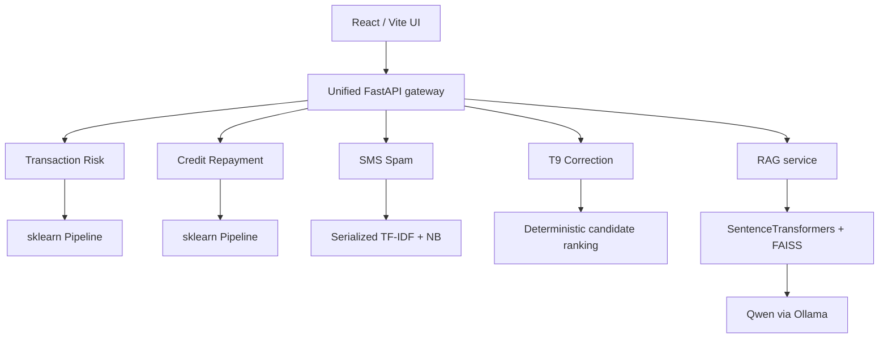

# Machine Learning Projects

[](https://github.com/Davidkaaa33/ML-projects/actions/workflows/ci.yml)
[](https://github.com/Davidkaaa33/ML-projects/actions/workflows/rag-evaluation.yml)

**[Live Demo →](https://ml-systems-lab-davidkaaa33.up.railway.app)**

## ML Systems Lab

A portfolio of **five independently evaluated ML systems** packaged behind one recruiter-facing product.

The goal of this repository is not only to show model training. Each project documents the full path from **data and validation design → modeling → held-out evaluation → reproducible artifacts → inference → software delivery**. Benchmark claims are kept separate from interactive demo behavior so that the UI does not blur training methodology with serving convenience.

### At a glance

| System | Task | Data | Core method | Held-out / committed result |
| --- | --- | --- | --- | --- |
| [Transaction Risk](bank-transaction-fraud-detection/) | rare-event binary classification | included synthetic transaction dataset | feature engineering + Random Forest | ROC-AUC **0.8713** · PR-AUC **0.3399** |
| [Credit Repayment](credit-repayment-prediction/) | binary classification | included synthetic credit dataset | leakage-safe preprocessing + Random Forest | ROC-AUC **0.9550** · F1 **0.9162** |
| [SMS Spam](spam-detector/) | text classification | SMS Spam Collection | TF-IDF + Multinomial NB | Precision **1.0000** · F1 **0.7642** |
| [T9 Correction](T9-typo-correction/) | candidate ranking + typo-type classification | included synthetic typo pairs | edit-distance ranking + Random Forest | Top-1 **0.9775** · Top-3 **0.9982** |
| [Knowledge Assistant](llm-knowledge-base-assistant/) | local RAG | local TXT/PDF corpus + labeled eval set | SentenceTransformers + FAISS + Qwen/Ollama | Hit@1 **81.82%** · Hit@3 **100%** · MRR@3 **0.9091** |

> **External flagship project:** [Avito Candidate Retrieval](https://github.com/Davidkaaa33/avito-ds-bootcamp-2026-solution) — hybrid BM25 + BGE-M3 + geography + microcategory + query-history retrieval, **Recall@50 0.831562**.

---

## End-to-end workflow

The individual projects use different algorithms, but they follow the same engineering discipline.

```mermaid
flowchart LR
    D[Raw / source data] --> V[Schema & quality checks]
    V --> S[Leakage-aware split]
    S --> B[Baseline]
    B --> E[Experiments / feature work]
    E --> M[Model selection on validation data]
    M --> H[Untouched held-out evaluation]
    H --> A[Committed metric artifacts]
    A --> I[Inference adapters]
    I --> API[Unified FastAPI]
    API --> WEB[React / Vite portfolio]
```



For projects where a validation set is available, model or threshold choices are made **before** touching the final test split. Machine-readable result snapshots are committed so the metrics shown in documentation can be checked against repository artifacts.

---

## Product architecture



The public deployment is available at **[ml-systems-lab-davidkaaa33.up.railway.app](https://ml-systems-lab-davidkaaa33.up.railway.app)**. The React production build is served by the unified FastAPI application in a single Railway service.

The heavier RAG runtime remains optional because embeddings, FAISS and local generation have materially different resource requirements from the classical models.

---

## Data provenance

| Project | Source used in this repository | Important note |
| --- | --- | --- |
| Transaction Risk | `bank-transaction-fraud-detection/data/bank_transactions_fraud_dataset.csv` | synthetic; 30,000 rows; rare positive class |
| Credit Repayment | `credit-repayment-prediction/data/credit_repayment_dataset.csv` | synthetic; 5,000 rows |
| SMS Spam | `spam-detector/data/spam.csv` | SMS Spam Collection; exact duplicate messages removed before split |
| T9 Correction | `T9-typo-correction/data/t9_typo_correction_dataset.csv` | synthetic typo/correction pairs; closed candidate vocabulary |
| Knowledge Assistant | local TXT/PDF documents + `eval/questions.json` | deliberately small RAG evaluation corpus; not presented as a broad-domain benchmark |

Synthetic datasets are labeled as synthetic in both project documentation and the web interface. Their purpose is to demonstrate modeling and evaluation methodology, not to claim production-domain validity.

---

## Evaluation methodology

### Transaction Risk

The dataset is split **60% train / 20% validation / 20% test** with target stratification. Logistic Regression and Random Forest configurations are compared by **validation PR-AUC**, which is more informative than accuracy under strong class imbalance. The classification threshold is then selected on validation predictions by maximum F1. The untouched test split is evaluated once after model and threshold selection.

### Credit Repayment

A stratified **60/20/20** split is used. Logistic Regression provides a linear reference and Random Forest captures nonlinear effects. Candidate configurations are selected by validation **ROC-AUC**; the selected pipeline is then evaluated on the untouched test split.

### SMS Spam

Exact duplicate messages are removed before splitting so the same SMS cannot leak across train and test. A stratified **80/20** split is used, and the complete text pipeline is serialized as one sklearn artifact.

### T9 Correction

Candidate ranking and typo-type classification are evaluated separately. Ranking is measured directly over the full synthetic typo/correction set. The typo classifier is evaluated on a stratified **80/20** split, with the documentation explicitly distinguishing conditional classifier accuracy from end-to-end correction accuracy.

### Knowledge Assistant

Retrieval is measured independently from generation using Hit@k and MRR. A separate answerable/unanswerable set is used to calibrate an optional retrieval-score abstention threshold. The threshold is measured and committed, but intentionally not enabled by default because the calibration set is small.

---

## Product boundary

The web application does not silently replace benchmark methodology with demo-specific training.

- **Spam** loads the committed `model.joblib` pipeline.
- **T9** calls the evaluated deterministic ranking implementation directly.
- **Fraud and Credit** lazily fit an interactive demo model using the already selected configuration and the full synthetic dataset.
- **Reported held-out metrics do not come from those demo fits**; they remain sourced from committed evaluation artifacts.
- **RAG** stays a separate optional service and can be unavailable while the site still exposes committed retrieval and abstention metrics.

This separation makes it possible to demonstrate inference without overstating what the interactive endpoint itself proves.

---

## Engineering evidence

| Area | Repository evidence |
| --- | --- |
| Evaluation | held-out metrics · JSON snapshots · retrieval evaluation · abstention calibration |
| Testing | pytest suites for classical systems, RAG components and API contracts |
| Static quality | Ruff · Python compile checks · diff hygiene |
| Serving | FastAPI project services · unified API gateway · health endpoints |
| Frontend | React + Vite recruiter-facing interface |
| Containers | non-root images · health checks · Docker Compose |
| Security hygiene | pinned direct dependencies · `pip-audit` in CI |
| Reproducibility | Python 3.12 · deterministic seeds/splits · committed artifacts · Makefile |
| RAG controls | pinned embedding revision · semantic metric-drift verification |

---

## Repository map

```text
apps/
├── api/                         unified inference gateway + model registry
└── web/                         recruiter-facing React interface

bank-transaction-fraud-detection/
├── data/
├── artifacts/
├── tests/
└── fraud_detection.py

credit-repayment-prediction/
├── data/
├── artifacts/
├── tests/
└── train.py

spam-detector/
├── data/
├── artifacts/
├── tests/
├── train.py
├── app.py
└── Dockerfile

T9-typo-correction/
├── data/
├── artifacts/
├── tests/
├── simple_typo_corrector.py
├── advanced_typo_corrector.py
└── typo_type_classifier.py

llm-knowledge-base-assistant/
├── app/
├── data/
├── eval/
├── tests/
└── Dockerfile

scripts/                         repository-level validation
.github/workflows/               CI + RAG evaluation
docker-compose.yml               full product stack
Makefile                         local quality/evaluation commands
```

Each project directory contains a dedicated README with the **data, modeling workflow, validation design, metrics, inference path and limitations** for that system.

---

## Run the product locally

### Standard stack

```bash
docker compose up --build
```

Open **http://localhost:8080**.

### Stack with local RAG generation

Install/start Ollama on the host, make the configured `qwen3.5:4b` model available, then run:

```bash
docker compose --profile rag up --build
```

Without the RAG runtime, the rest of the portfolio remains available.

---

## Local quality gates

Install the lightweight dependencies used by repository checks:

```bash
make install-check
make check
```

To reproduce the heavier retrieval evaluation:

```bash
make install-rag
make rag-verify
```

`make rag-verify` rebuilds the FAISS index, recomputes retrieval and abstention metrics, and compares them with committed snapshots using a small numerical tolerance.

---

## What this repository is intended to demonstrate

This repository is deliberately structured as more than a notebook collection. It demonstrates:

- problem formulation and metric selection;
- leakage-aware preprocessing and validation;
- baseline-first experimentation;
- model and threshold selection on validation data;
- explicit separation between benchmark evidence and demo inference;
- error analysis and limitations;
- reproducible artifacts and deterministic workflows;
- FastAPI model serving;
- Docker and CI;
- retrieval evaluation, citations and abstention for RAG systems.

The detailed README in each project directory contains the model-specific reasoning and reproducibility instructions.
