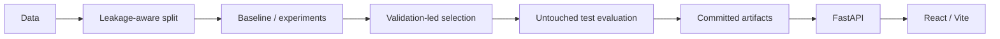

# Machine Learning Projects

[](https://github.com/Davidkaaa33/ML-projects/actions/workflows/ci.yml)
[](https://github.com/Davidkaaa33/ML-projects/actions/workflows/rag-evaluation.yml)

**[Live Demo →](https://ml-systems-lab-davidkaaa33.up.railway.app)**

## ML Systems Lab

Five independently evaluated ML systems packaged behind one FastAPI + React product.

The focus is the full ML workflow: **data → validation → modeling → held-out evaluation → reproducible artifacts → inference**.

| System | What it demonstrates | Result |
| --- | --- | --- |
| [Transaction Risk](bank-transaction-fraud-detection/) | imbalanced classification · feature engineering · threshold tuning | ROC-AUC **0.8713** · PR-AUC **0.3399** |
| [Credit Repayment](credit-repayment-prediction/) | leakage-safe preprocessing · model selection | ROC-AUC **0.9550** · F1 **0.9162** |
| [SMS Spam](spam-detector/) | text classification · deduplication · API serving | Precision **1.0000** · F1 **0.7642** |
| [T9 Correction](T9-typo-correction/) | candidate ranking · typo classification | Top-1 **0.9775** · Top-3 **0.9982** |
| [Knowledge Assistant](llm-knowledge-base-assistant/) | local RAG · FAISS · citations · abstention | Hit@1 **81.82%** · Hit@3 **100%** · MRR@3 **0.9091** |

> **External flagship:** [Avito Candidate Retrieval](https://github.com/Davidkaaa33/avito-ds-bootcamp-2026-solution) — BM25 + BGE-M3 + geography + microcategory + query history, **Recall@50 0.831562**.

## Workflow



Where a validation set is used, model and threshold decisions are made before the final test split is evaluated.

## Product architecture

```text
React / Vite
     │
     ▼
Unified FastAPI
     │
     ├── Transaction Risk ── sklearn Pipeline
     ├── Credit Repayment ── sklearn Pipeline
     ├── SMS Spam ────────── TF-IDF + Naive Bayes
     ├── T9 Correction ───── deterministic ranking
     └── Knowledge Assistant ── FAISS + Qwen/Ollama
```

The public deployment runs as one Railway service. The heavier RAG runtime is optional.

## Evaluation discipline

- **Fraud:** stratified 60/20/20 split, model selection by validation PR-AUC, threshold tuned on validation F1.
- **Credit:** stratified 60/20/20 split, model selection by validation ROC-AUC.
- **Spam:** exact duplicates removed before the 80/20 split to prevent identical train/test samples.
- **T9:** candidate ranking and typo-type classification are evaluated separately.
- **RAG:** retrieval is evaluated independently from generation; abstention is calibrated on a separate labeled set.

Synthetic datasets are explicitly labeled as synthetic and are used to demonstrate methodology, not production-domain performance.

## Engineering

| Area | Evidence |
| --- | --- |
| Evaluation | held-out metrics · JSON snapshots · retrieval evaluation |
| Quality | pytest · Ruff · compile checks · API tests |
| Serving | unified FastAPI gateway · health endpoints |
| Frontend | React + Vite |
| Containers | Docker · Compose · non-root runtime |
| CI | GitHub Actions · dependency auditing |
| Reproducibility | deterministic splits · committed metrics · Makefile |
| RAG | pinned embedding revision · citations · abstention calibration |

The web demo and benchmark evidence are kept separate: reported metrics come from committed evaluation artifacts, not from interactive demo fits.

## Repository map

```text
apps/
├── api/                         unified inference gateway
└── web/                         recruiter-facing UI

bank-transaction-fraud-detection/
credit-repayment-prediction/
spam-detector/
T9-typo-correction/
llm-knowledge-base-assistant/

scripts/                         repository checks
.github/workflows/               CI + RAG evaluation
docker-compose.yml
Makefile
```

Each project directory contains a dedicated README with its data, workflow, metrics and limitations.

## Run locally

```bash
docker compose up --build
```

Open **http://localhost:8080**.

With local RAG generation:

```bash
docker compose --profile rag up --build
```

Quality checks:

```bash
make install-check
make check
```

RAG evaluation:

```bash
make install-rag
make rag-verify
```
