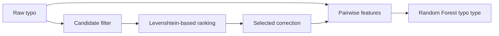

# T9 Typo Correction

A two-stage typo-correction project: candidate ranking first, typo-type classification second.

| | |
| --- | --- |
| **Data** | 1,647 synthetic typo/correction pairs |
| **Candidate vocabulary** | closed vocabulary from `correct_word` |
| **Top-1 candidate accuracy** | **0.9775** |
| **Top-3 candidate recall** | **0.9982** |
| **Conditional typo-type accuracy** | **1.0000** |

## Workflow



## Candidate ranking

Source: `data/t9_typo_correction_dataset.csv`.

`simple_typo_corrector.py` provides a `difflib` baseline. The main ranker in `advanced_typo_corrector.py` keeps candidates that:

- start with the same first letter;
- have Levenshtein distance ≤ 2.

The explicit score rewards matching first/last letters, smaller edit distance and similar word length. Ties are deterministic.

Evaluation over all 1,647 rows:

| Metric | Value |
| --- | ---: |
| Top-1 accuracy | **0.9775** |
| Top-3 recall | **0.9982** |

Snapshot: `artifacts/candidate_results.json`.

## Typo-type classifier

The Random Forest classifier uses features derived only from the observed typo and selected candidate:

- edit distance;
- candidate and typo length;
- length difference;
- first-letter match.

It is evaluated on a stratified 80/20 split with `random_state=42`.

Reported accuracy is **1.0000**, but this is a **conditional metric**: evaluation supplies the known correct candidate. End-to-end performance can be lower when candidate ranking selects the wrong word.

Snapshot: `artifacts/classifier_results.json`.

## Run

```bash
cd T9-typo-correction
pip install -r requirements.txt

python simple_typo_corrector.py
python advanced_typo_corrector.py
python typo_type_classifier.py
```

## Limitations

The vocabulary and typo rules are synthetic and closed-world. The current ranker does not use word frequency, sentence context or a language model, and classifier accuracy should not be interpreted as end-to-end correction accuracy.
