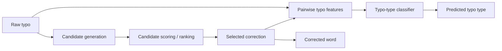

# T9 Typo Correction

A two-stage typo-correction project that separates **candidate retrieval/ranking** from **typo-type classification**.

| | |
| --- | --- |
| **Dataset** | included synthetic typo/correction pairs |
| **Rows** | 1,647 |
| **Candidate vocabulary** | closed vocabulary derived from `correct_word` |
| **Top-1 candidate accuracy** | **0.9775** |
| **Top-3 candidate recall** | **0.9982** |
| **Conditional typo-type accuracy** | **1.0000** |

## 1. Problem decomposition

A typo corrector actually contains two different tasks:

1. **Which known word is the user most likely trying to type?**
2. **What kind of typo occurred between the observed word and the selected candidate?**

The repository keeps those stages separate so their metrics are not mixed together.



---

## 2. Data

Repository file:

```text
data/t9_typo_correction_dataset.csv
```

The dataset is **synthetic** and contains 1,647 typo/correction pairs.

The labels cover five generated typo categories:

- replacement;
- deletion;
- insertion near the ending;
- last-two-letter swap;
- no typo.

Important fields used by the implementation include:

- `typo_word`
- `correct_word`
- `typo_type`

The candidate vocabulary is built from the unique `correct_word` values in the same dataset.

---

## 3. Baseline

`simple_typo_corrector.py` uses Python `difflib.get_close_matches`.

Its purpose is to provide a minimal edit/similarity reference before the more explicit ranking logic.

---

## 4. Candidate generation and ranking

The main ranking implementation is in:

```text
advanced_typo_corrector.py
```

### Candidate filter

For an observed typo, candidates must:

1. be non-empty strings;
2. start with the same first letter;
3. have Levenshtein distance ≤ 2.

This aggressively reduces the closed vocabulary before ranking.

### Explicit ranking score

For each surviving candidate:

```text
+2  same first letter
+2  same last letter
+max(0, 10 - Levenshtein distance)
+max(0, 2 - absolute length difference)
```

Candidates are sorted by descending score and then alphabetically to make ties deterministic.

This design keeps the ranking behavior inspectable instead of hiding it behind an opaque model.

---

## 5. Candidate-ranking evaluation

Every row in the 1,647-row dataset is evaluated against the closed vocabulary.

| Metric | Value |
| --- | ---: |
| Top-1 candidate accuracy | **0.9775** |
| Top-3 candidate recall | **0.9982** |

### Metric interpretation

**Top-1 accuracy** asks whether the expected correction is the first candidate.

**Top-3 recall** asks whether the expected correction appears anywhere in the first three candidates.

The high Top-3 value is useful for systems where a user can choose among several suggestions rather than requiring an automatic single correction.

Machine-readable snapshot:

```text
artifacts/candidate_results.json
```

---

## 6. Typo-type classification

The second stage is implemented in:

```text
typo_type_classifier.py
```

The classifier does **not** use precomputed ground-truth-relative columns from the dataset at inference time.

Instead, it derives features from the observed typo and the selected candidate:

| Feature | Meaning |
| --- | --- |
| `edit_distance` | Levenshtein distance between typo and candidate |
| `candidate_length` | candidate length |
| `typo_length` | observed typo length |
| `length_difference` | candidate length - typo length |
| `same_first_letter` | binary first-letter match |

A Random Forest with 200 trees and `max_depth=8` is fitted on these pairwise features.

---

## 7. Classifier evaluation

The typo-type dataset is split:

| Partition | Share |
| --- | ---: |
| Train | 80% |
| Test | 20% |

with stratification and `random_state=42`.

Reported test accuracy:

```text
1.0000
```

### Important evaluation boundary

This is a **conditional** result.

During classifier evaluation, the feature extractor receives the known correct candidate from the dataset. In real end-to-end inference, the classifier receives the candidate produced by the ranking stage.

Therefore:

```text
conditional typo-type accuracy ≠ end-to-end correction accuracy
```

If ranking selects the wrong candidate, downstream typo-type classification can also become incorrect.

The synthetic generation rules also make the classes unusually separable through edit distance and length difference, so the 1.0000 result should not be interpreted as a realistic open-world benchmark.

Machine-readable snapshot:

```text
artifacts/classifier_results.json
```

---

## 8. End-to-end inference

```text
user word
   ↓
normalize to lowercase
   ↓
closed-vocabulary candidate filter
   ↓
Levenshtein + heuristic ranking
   ↓
top candidate
   ↓
pairwise feature extraction
   ↓
Random Forest typo-type prediction
```

For sentence correction, very short words and words already present in the candidate vocabulary are left unchanged.

---

## 9. Run locally

```bash
cd T9-typo-correction
pip install -r requirements.txt

python simple_typo_corrector.py
python advanced_typo_corrector.py
python typo_type_classifier.py
```

The last two commands regenerate the committed candidate-ranking and classifier metric snapshots.

---

## 10. Limitations

- Candidate generation is **closed vocabulary**; unseen intended words cannot be recovered.
- The dataset is synthetic.
- Ranking evaluation uses the same vocabulary derived from the dataset.
- The typo rules are simpler than real mobile-keyboard error patterns.
- The classifier result is conditional on a supplied candidate.
- The current ranker does not use word frequency, sentence context or a language model.

Natural next steps would include contextual reranking, frequency priors, keyboard-adjacency features and an end-to-end evaluation where the classifier receives the ranker's predicted candidate.
