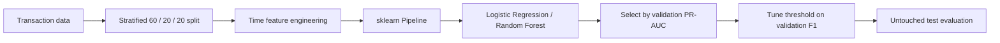

# Bank Transaction Fraud Detection

Rare-event transaction classification with leakage-safe preprocessing, validation-led model selection and threshold tuning.

| | |
| --- | --- |
| **Data** | 30,000 synthetic transactions · 1,326 fraud cases |
| **Selection metric** | validation PR-AUC |
| **Final model** | Random Forest |
| **Decision threshold** | 0.15 |
| **Test ROC-AUC** | **0.8713** |
| **Test PR-AUC** | **0.3399** |

## Workflow



## Data and features

Source: `data/bank_transactions_fraud_dataset.csv`.

The dataset is synthetic. `transaction_id` is removed. The Greenwich timestamp is converted into:

- transaction hour;
- sender local hour;
- recipient local hour;
- a night-transaction flag.

Numeric and categorical transformations are fitted inside the sklearn Pipeline. Categorical features use `OneHotEncoder(handle_unknown="ignore")`; numeric scaling is applied for Logistic Regression.

## Validation

The split is deterministic and stratified with `random_state=42`:

| Train | Validation | Test |
| ---: | ---: | ---: |
| 60% | 20% | 20% |

The test split is not used for model or threshold selection.

Models compared:

- Dummy class-prior baseline;
- Logistic Regression with `C ∈ {0.1, 1.0}` and optional class weighting;
- Random Forest with depth, leaf-size and class-weight variants.

PR-AUC is used for selection because the positive class is rare. After model selection, the probability threshold is chosen on validation predictions by maximum F1.

## Results

Best validation configuration per model family:

| Model | ROC-AUC | PR-AUC | F1 @ 0.50 |
| --- | ---: | ---: | ---: |
| Dummy baseline | 0.5000 | 0.0442 | 0.0000 |
| Logistic Regression | 0.8753 | 0.2719 | 0.2429 |
| Random Forest | **0.8973** | **0.3842** | 0.0000 |

The selected Random Forest uses `max_depth=8`, `min_samples_leaf=4`, no class weighting and a validation-tuned threshold of **0.15**.

| Test metric | Value |
| --- | ---: |
| ROC-AUC | **0.8713** |
| PR-AUC | **0.3399** |
| Precision | **0.3452** |
| Recall | **0.4038** |
| F1 | **0.3722** |

The reproducible metric snapshot is stored in `artifacts/results.json`.

## Run

```bash
cd bank-transaction-fraud-detection
pip install -r requirements.txt
python fraud_detection.py
```

## Limitations

The dataset is synthetic, timezone offsets are simplified, the search space is intentionally small, and the threshold optimizes F1 rather than real fraud costs. The reported metrics demonstrate the evaluation workflow, not production fraud-detection performance.
