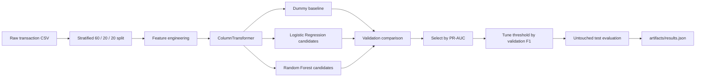

# Bank Transaction Fraud Detection

Binary classification of rare fraudulent bank transactions with explicit feature engineering, validation-led model selection and threshold tuning.

| | |
| --- | --- |
| **Task** | binary classification: normal transaction `0` vs fraud `1` |
| **Dataset** | included synthetic transaction dataset |
| **Rows** | 30,000 |
| **Fraud rows** | 1,326 |
| **Selection metric** | validation PR-AUC |
| **Final model** | Random Forest |
| **Final threshold** | 0.15 |
| **Test ROC-AUC** | **0.8713** |
| **Test PR-AUC** | **0.3399** |

## 1. Problem formulation

Fraud detection is a rare-event classification problem. In this dataset only about 4.4% of rows are fraudulent, so plain accuracy would be a poor model-selection criterion: a model can be highly accurate while missing most positive cases.

The project therefore separates three questions:

1. **Ranking quality:** can the model place fraudulent transactions above normal transactions?
2. **Minority-class retrieval:** does the ranking remain useful under class imbalance?
3. **Decision policy:** at what probability threshold should a transaction become an alert?

ROC-AUC and PR-AUC answer the first two questions, while precision/recall/F1 describe the thresholded decision rule.

---

## 2. Data

Source used by the project:

```text
data/bank_transactions_fraud_dataset.csv
```

The dataset is **synthetic** and is committed to the repository for reproducibility.

### Target

`is_fraud`

- `0` — normal transaction
- `1` — fraudulent transaction

### Raw feature groups

**Customer / account**

- `customer_age`
- `account_age_days`
- `account_balance`
- `avg_transaction_amount`

**Current transaction**

- `transaction_amount`
- `transaction_type`
- `device_type`
- `risk_segment`

**Recent behavior**

- `previous_failed_attempts`
- `transactions_last_24h`
- `days_since_last_transaction`

**Geography / time**

- `sender_country`
- `recipient_country`
- `time_by_greenwich`

`transaction_id` is treated as an identifier and is removed before modeling.

---

## 3. End-to-end workflow



All transformations live inside sklearn Pipelines, so validation and inference use the same feature logic.

---

## 4. Feature engineering

The raw Greenwich timestamp is converted into three time-derived features:

- `transaction_time_hour` — UTC/Greenwich hour;
- `sender_local_hour` — Greenwich hour shifted by sender-country offset;
- `recipient_local_hour` — Greenwich hour shifted by recipient-country offset.

A binary `night_transaction` feature is also derived when both sender and recipient local times are between 00:00 and 06:00.

The original timestamp and `transaction_id` are dropped after feature generation.

The goal is to expose behavioral time context to the model without forcing the estimator to interpret a raw datetime string.

---

## 5. Preprocessing

### Numeric features

```text
customer_age
account_age_days
account_balance
avg_transaction_amount
transaction_amount
previous_failed_attempts
transactions_last_24h
days_since_last_transaction
transaction_time_hour
sender_local_hour
recipient_local_hour
night_transaction
```

Numeric values are standardized for Logistic Regression and passed through unchanged for tree models.

### Categorical features

```text
sender_country
recipient_country
risk_segment
transaction_type
device_type
```

Categorical values are transformed with:

```python
OneHotEncoder(handle_unknown="ignore")
```

This prevents unseen categories at inference time from crashing the pipeline.

---

## 6. Validation design

The split is deterministic and stratified with `random_state=42`:

| Partition | Share |
| --- | ---: |
| Train | 60% |
| Validation | 20% |
| Test | 20% |

The final test partition is not used for model or threshold selection.

### Why PR-AUC is the selection metric

Fraud is rare. PR-AUC concentrates on the positive class and reflects the precision/recall trade-off better than accuracy. ROC-AUC is still reported because it measures ranking performance across thresholds, but **validation PR-AUC drives model selection**.

---

## 7. Models and search space

### Dummy baseline

`DummyClassifier(strategy="prior")`

This establishes the performance of a model that only reproduces the training class prior.

### Logistic Regression

Candidates vary:

- `C ∈ {0.1, 1.0}`
- `class_weight ∈ {None, "balanced"}`

### Random Forest

All candidates use 200 trees. The search varies:

- `max_depth ∈ {8, None}`
- `min_samples_leaf ∈ {1, 4}`
- `class_weight ∈ {None, "balanced"}`

The best configuration within each model family is selected on validation PR-AUC.

---

## 8. Validation comparison

Best configuration per model family at threshold 0.50:

| Model | ROC-AUC | PR-AUC | Precision | Recall | F1 |
| --- | ---: | ---: | ---: | ---: | ---: |
| Dummy baseline | 0.5000 | 0.0442 | 0.0000 | 0.0000 | 0.0000 |
| Logistic Regression | 0.8753 | 0.2719 | 0.1445 | 0.7623 | 0.2429 |
| Random Forest | **0.8973** | **0.3842** | 0.0000 | 0.0000 | 0.0000 |

The Random Forest ranks transactions substantially better than the baseline, but at the default 0.50 threshold it does not emit positive predictions. That is exactly why threshold selection is treated as a separate step.

---

## 9. Threshold tuning

After the Random Forest is selected by validation PR-AUC, its classification threshold is tuned **only on validation predictions**.

The script evaluates:

```text
0.05, 0.10, 0.15, ..., 0.95
```

and selects the threshold with maximum validation F1.

Selected threshold:

```text
0.15
```

This avoids conflating ranking quality with the operating threshold.

---

## 10. Final held-out test result

Selected model:

```text
Random Forest
max_depth=8
min_samples_leaf=4
class_weight=None
n_estimators=200
threshold=0.15
```

| Test metric | Value |
| --- | ---: |
| ROC-AUC | **0.8713** |
| PR-AUC | **0.3399** |
| Precision | **0.3452** |
| Recall | **0.4038** |
| F1 | **0.3722** |

Interpretation:

- ROC-AUC indicates useful overall ranking ability.
- PR-AUC is materially above the fraud prevalence baseline.
- Precision means roughly one third of emitted alerts are true fraud in this synthetic test set.
- Recall means the selected threshold catches roughly 40% of fraudulent cases.

The threshold optimizes validation F1, **not a real financial cost function**.

---

## 11. Reproducible artifact

The documented run is stored in:

```text
artifacts/results.json
```

The artifact records:

- dataset provenance flag;
- split proportions and seed;
- model-selection metric;
- selected configuration;
- threshold-selection rule;
- final held-out metrics.

Regenerate it with:

```bash
python fraud_detection.py
```

---

## 12. Inference path

`predict_transaction(...)` accepts one transaction as a dictionary, wraps it into a DataFrame, runs the same sklearn Pipeline used during evaluation, returns a fraud probability and applies the selected threshold.

```text
raw transaction
      ↓
time feature engineering
      ↓
numeric / categorical preprocessing
      ↓
Random Forest probability
      ↓
threshold = 0.15
      ↓
fraud / normal decision
```

---

## 13. Run locally

```bash
cd bank-transaction-fraud-detection
pip install -r requirements.txt
python fraud_detection.py
```

Repository-level tests can also be run through the root Makefile / CI.

---

## 14. Limitations

- The dataset is synthetic and cannot represent real fraud drift, adversarial adaptation or institution-specific behavior.
- Country offsets are simplified fixed mappings rather than a complete timezone/DST model.
- The validation search is intentionally small.
- Threshold optimization uses F1 rather than monetary false-positive / false-negative costs.
- No probability calibration study is performed.

This project is intended to demonstrate **imbalanced classification, leakage-safe pipelines, validation-led model selection and threshold reasoning**, not to claim production fraud-detection performance.
