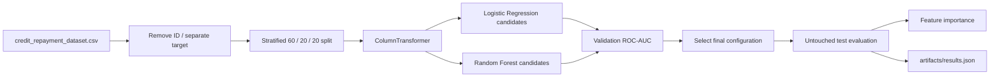

# Credit Repayment Prediction

A tabular binary-classification project focused on leakage-safe preprocessing, validation-led model selection and interpretable model diagnostics.

| | |
| --- | --- |
| **Task** | predict whether a customer repays a credit |
| **Dataset** | included synthetic credit dataset |
| **Rows** | 5,000 |
| **Positive outcomes** | 3,342 |
| **Negative outcomes** | 1,658 |
| **Selection metric** | validation ROC-AUC |
| **Final model** | Random Forest |
| **Test ROC-AUC** | **0.9550** |
| **Test F1** | **0.9162** |

## 1. Problem formulation

The dataset contains customer, loan and repayment-history attributes. The goal is to estimate the probability of a positive repayment outcome.

The legacy target column is named `is_refunded`; in this project it is interpreted as **repayment status**.

The identifier `customer_id` is explicitly removed before training so the model cannot learn from a row identity.

---

## 2. Data

Source used by the project:

```text
data/credit_repayment_dataset.csv
```

The dataset is **synthetic** and committed for reproducibility.

### Numeric inputs

- `credit_amount`
- `customer_age`
- `credit_score`
- `income`
- `previous_loans`
- `previous_refunds`
- `late_payments`
- `days_since_credit`
- `support_tickets`

### Categorical inputs

- `employment_status`
- `loan_purpose`
- `payment_method`

### Excluded fields

- `customer_id` — identifier
- `is_refunded` — target

---

## 3. Workflow



Preprocessing is fitted only inside sklearn Pipelines. This keeps category learning and numeric scaling tied to the training partition rather than preprocessing the full dataset in advance.

---

## 4. Preprocessing

### Numeric branch

Logistic Regression uses `StandardScaler` because coefficient-based optimization is sensitive to feature scale.

Random Forest receives numeric values without scaling because tree splits are invariant to monotonic rescaling.

### Categorical branch

All categorical features use:

```python
OneHotEncoder(handle_unknown="ignore")
```

This means a previously unseen category can be passed through inference without breaking the pipeline.

---

## 5. Validation strategy

A deterministic stratified split with `random_state=42` is used:

| Partition | Share |
| --- | ---: |
| Train | 60% |
| Validation | 20% |
| Test | 20% |

The test split is held back until the model family and hyperparameters have been selected.

### Why ROC-AUC

The output of interest is a probability/ranking as well as a class label. ROC-AUC measures whether positive outcomes are ranked above negative outcomes across thresholds, so it is used as the validation selection metric.

Thresholded accuracy, precision, recall and F1 are still reported at the default 0.50 threshold for operational interpretation.

---

## 6. Candidate models

### Logistic Regression

A linear baseline with:

```text
C ∈ {0.1, 1.0}
```

### Random Forest

All candidates use 200 estimators. The grid is:

```text
max_depth ∈ {6, 10, None}
min_samples_leaf ∈ {1, 4}
```

Each candidate is trained only on the training partition and ranked on validation ROC-AUC.

---

## 7. Validation results

Best configuration from each model family:

| Model | ROC-AUC | Accuracy | Precision | Recall | F1 |
| --- | ---: | ---: | ---: | ---: | ---: |
| Logistic Regression (`C=1.0`) | 0.8917 | 0.8360 | 0.8652 | 0.8937 | 0.8792 |
| Random Forest (`max_depth=10`, `min_samples_leaf=1`) | **0.9521** | **0.8860** | **0.8837** | **0.9551** | **0.9180** |

Random Forest is selected because it provides the strongest validation ROC-AUC.

---

## 8. Final held-out test result

| Metric | Value |
| --- | ---: |
| ROC-AUC | **0.9550** |
| Accuracy | **0.8870** |
| Precision | **0.9075** |
| Recall | **0.9251** |
| F1 | **0.9162** |

The result is measured once on the untouched test partition after model selection.

---

## 9. Feature-importance inspection

The fitted Random Forest is inspected after evaluation. The ten largest importances are:

| Feature | Importance |
| --- | ---: |
| previous refunds | 0.2753 |
| late payments | 0.1767 |
| credit score | 0.1304 |
| support tickets | 0.1023 |
| credit amount | 0.0715 |
| income | 0.0485 |
| days since credit | 0.0482 |
| customer age | 0.0408 |
| previous loans | 0.0260 |
| employment status: unemployed | 0.0083 |

These are **model usage statistics**, not causal claims. A feature can be important because it is predictive, correlated with another feature, or frequently useful for tree splits.

---

## 10. Reproducibility

The machine-readable evaluation snapshot is committed as:

```text
artifacts/results.json
```

It records the data path, synthetic-data flag, split design, random seed, selected model/configuration and final metrics.

Regenerate the full experiment:

```bash
cd credit-repayment-prediction
pip install -r requirements.txt
python train.py
```

---

## 11. Inference workflow

The trained estimator is an sklearn Pipeline:

```text
raw customer / credit row
        ↓
select numeric + categorical columns
        ↓
scale numeric values when required
        ↓
one-hot encode categories
        ↓
classifier
        ↓
repayment probability
        ↓
0.50 decision threshold
```

Because preprocessing lives inside the same Pipeline as the estimator, the transformation contract remains consistent between fitting and inference.

---

## 12. Limitations

- The data is synthetic and does not represent production credit-policy drift or real underwriting constraints.
- The current experiment uses one fixed validation split rather than repeated cross-validation.
- The hyperparameter search is intentionally small.
- The project does not perform probability calibration.
- Feature importances should not be read as causal effects.
- Real lending systems also require fairness, policy, legal and monitoring analysis that is outside this practice project.

The project demonstrates **tabular preprocessing, leakage-aware evaluation, model comparison and reproducible reporting**.
