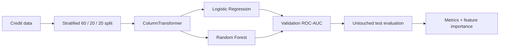

# Credit Repayment Prediction

Tabular binary classification with pipeline-based preprocessing and validation-led model selection.

| | |
| --- | --- |
| **Data** | 5,000 synthetic credit records |
| **Target** | repayment status (`is_refunded`) |
| **Selection metric** | validation ROC-AUC |
| **Final model** | Random Forest |
| **Test ROC-AUC** | **0.9550** |
| **Test F1** | **0.9162** |

## Workflow



## Data and preprocessing

Source: `data/credit_repayment_dataset.csv`.

The dataset is synthetic. `customer_id` is removed before training.

Numeric inputs include credit amount, age, credit score, income, previous loans/refunds, late payments, days since credit and support tickets. Categorical inputs are employment status, loan purpose and payment method.

Preprocessing stays inside an sklearn Pipeline:

- numeric scaling for Logistic Regression;
- passthrough numeric values for Random Forest;
- `OneHotEncoder(handle_unknown="ignore")` for categories.

## Validation and models

The deterministic stratified split uses `random_state=42`:

| Train | Validation | Test |
| ---: | ---: | ---: |
| 60% | 20% | 20% |

Candidate models:

- Logistic Regression: `C ∈ {0.1, 1.0}`;
- Random Forest: 200 trees with `max_depth ∈ {6, 10, None}` and `min_samples_leaf ∈ {1, 4}`.

The final test split is evaluated only after the best validation ROC-AUC configuration is selected.

## Results

| Model | Validation ROC-AUC | Validation F1 |
| --- | ---: | ---: |
| Logistic Regression (`C=1.0`) | 0.8917 | 0.8792 |
| Random Forest (`max_depth=10`, `min_samples_leaf=1`) | **0.9521** | **0.9180** |

Final test result:

| Metric | Value |
| --- | ---: |
| ROC-AUC | **0.9550** |
| Accuracy | **0.8870** |
| Precision | **0.9075** |
| Recall | **0.9251** |
| F1 | **0.9162** |

Most-used Random Forest features include previous refunds, late payments, credit score, support tickets and credit amount. These are model importances, not causal effects.

The reproducible metric snapshot is stored in `artifacts/results.json`.

## Run

```bash
cd credit-repayment-prediction
pip install -r requirements.txt
python train.py
```

## Limitations

The data is synthetic, model comparison uses one fixed validation split, the hyperparameter search is intentionally small, and probabilities are not separately calibrated. Real lending systems would additionally require fairness, policy and monitoring analysis.
