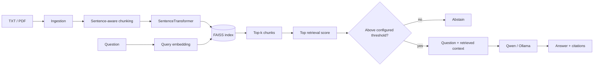

# LLM Knowledge Base Assistant

A local Retrieval-Augmented Generation service for answering questions from internal TXT/PDF documents with explicit retrieval evaluation, citations and optional confidence-based abstention.

| | |
| --- | --- |
| **Documents** | TXT / PDF |
| **Embeddings** | SentenceTransformers |
| **Vector search** | FAISS |
| **Generation** | Qwen via local Ollama |
| **Serving** | FastAPI |
| **Evaluation** | retrieval + answer checks + citation audit + abstention calibration |
| **Hit@1** | **81.82%** |
| **Hit@3** | **100%** |
| **MRR@3** | **0.9091** |

No paid hosted LLM API is required for the runtime path.

## 1. System objective

The system should answer a question only from the local knowledge base and make the grounding path inspectable.

That creates four separate engineering concerns:

1. **ingestion** — load source documents consistently;
2. **retrieval** — find the most relevant chunks;
3. **generation** — answer from retrieved evidence;
4. **confidence / evaluation** — measure retrieval quality and reject weakly supported questions when configured.

The project evaluates retrieval separately so a fluent LLM response cannot hide a weak retrieval layer.

---

## 2. Architecture



---

## 3. Offline indexing workflow

### Step 1 — ingest documents

`app/ingestion.py` loads supported source files.

- TXT is read as UTF-8 text.
- PDF text is extracted with PyPDF.

Each document keeps source metadata so retrieved chunks can later be mapped back to a citation.

### Step 2 — chunk text

`app/chunking.py` performs sentence-aware chunking rather than arbitrary character slicing.

The goal is to keep semantically related sentences together while producing chunks small enough for retrieval and generation.

### Step 3 — embed chunks

`app/embeddings.py` wraps the configured SentenceTransformer model.

The embedding revision is pinned so evaluation snapshots are not silently changed by a moving upstream model branch.

### Step 4 — build the FAISS index

`app/build_index.py` loads documents, chunks them, embeds the chunks and persists:

- the FAISS vector index;
- chunk metadata required to recover sources.

---

## 4. Online query workflow

```text
question
   ↓
query embedding
   ↓
FAISS similarity search
   ↓
top-k chunks + similarity scores
   ↓
optional confidence gate
   ├── weak retrieval → abstain
   └── sufficient retrieval
            ↓
      build grounded prompt
            ↓
       Qwen via Ollama
            ↓
      answer + citations
```

`app/rag.py` orchestrates retrieval and generation.

`app/api.py` exposes the system through FastAPI.

---

## 5. Repository structure

| Path | Purpose |
| --- | --- |
| `app/ingestion.py` | TXT/PDF loading |
| `app/chunking.py` | sentence-aware text chunks |
| `app/embeddings.py` | embedding-model wrapper |
| `app/vector_store.py` | FAISS persistence and search |
| `app/retrieval.py` / `app/search.py` | retrieval flow |
| `app/confidence.py` | score parsing / threshold selection |
| `app/rag.py` | retrieval + generation orchestration |
| `app/llm.py` | Ollama/Qwen client |
| `app/api.py` | FastAPI service |
| `eval/questions.json` | labeled retrieval questions |
| `eval/evaluate_retrieval.py` | Hit@k / MRR evaluation |
| `eval/evaluate_answers.py` | answer / fact / citation checks |
| `eval/calibrate_abstention.py` | confidence-threshold calibration |
| `eval/verify_snapshot.py` | metric-snapshot drift check |
| `tests/` | API, confidence, ingestion/chunking and vector-store tests |

---

## 6. Retrieval evaluation

The repository includes a small labeled question set in `eval/questions.json`.

Retrieval is measured independently from generation using:

### Hit@1

Fraction of questions for which a relevant chunk is ranked first.

### Hit@3

Fraction of questions for which at least one relevant chunk appears in the first three results.

### MRR@3

Mean reciprocal rank of the first relevant result, limited to the first three positions.

Committed snapshot:

```text
eval/results.json
```

| Metric | Value |
| --- | ---: |
| Hit@1 | **81.82%** |
| Hit@3 | **100%** |
| MRR@3 | **0.9091** |

These values describe only the included evaluation corpus; they are not presented as a broad production benchmark.

---

## 7. Answer evaluation and citations

The evaluation directory separates retrieval quality from generation quality.

`eval/evaluate_answers.py` can check expected factual patterns and citation behavior, while the API returns source information alongside the generated answer.

This separation is deliberate:

```text
good prose ≠ good retrieval
good retrieval ≠ fully correct generation
citation present ≠ citation necessarily supports every claim
```

Each layer therefore remains observable.

---

## 8. Calibrated abstention

The service can reject weak retrieval **before** calling the LLM.

The repository does not hard-code an arbitrary confidence threshold. Instead, `eval/calibrate_abstention.py` searches a labeled answerable/unanswerable set and selects a threshold by balanced accuracy.

Run:

```bash
python eval/calibrate_abstention.py
```

Committed calibration snapshot:

```text
eval/threshold.json
```

Measured optimum on the included 14-question calibration set:

| Metric | Value |
| --- | ---: |
| Retrieval-score threshold | **0.61346** |
| Balanced accuracy | **90.91%** |
| Answerable recall | **81.82%** |
| Unanswerable recall | **100%** |

Enable explicitly:

```bash
export RAG_MIN_RETRIEVAL_SCORE="0.61346"
```

### Why it is opt-in

The calibration set is small. Enabling the measured threshold by default would silently reject a non-trivial share of answerable examples. The project therefore exposes the measured trade-off without pretending it is production-calibrated.

The API makes the decision observable through fields such as:

- `abstained`
- `abstention_reason`
- `top_retrieval_score`

---

## 9. Reproducibility

The embedding revision is pinned, and committed snapshots allow regenerated metrics to be compared with the documented state.

From the repository root:

```bash
make install-rag
make rag-verify
```

`make rag-verify` rebuilds the index, recomputes retrieval and abstention metrics and compares them with the committed snapshots using a small numerical tolerance.

This acts as a semantic evaluation gate in addition to normal unit tests.

---

## 10. Run locally

### Python environment

```bash
python -m venv .venv
source .venv/bin/activate
pip install -r requirements.txt
```

### Build the index

```bash
python -m app.build_index
```

### Local generation

Install and start Ollama separately and make the configured Qwen model available.

### Start API

```bash
uvicorn app.api:app --reload
```

### Tests

```bash
pip install -r requirements-dev.txt
pytest
```

---

## 11. Container / portfolio integration

The RAG service has its own Dockerfile and is also integrated into the repository-level Compose stack through an optional profile.

From the repository root:

```bash
docker compose --profile rag up --build
```

The portfolio can run without the heavy RAG service; committed evaluation results remain visible even when local generation is unavailable.

---

## 12. Design decisions

- **Local-first generation** keeps document context away from third-party hosted LLM APIs.
- **Retrieval is evaluated independently** so fluent generation cannot mask search failures.
- **Pinned embeddings** reduce metric drift caused by upstream model updates.
- **FAISS** provides a simple explicit vector-search layer suitable for local experimentation.
- **Abstention is calibrated rather than guessed.**
- **Citations are a first-class output and evaluation concern.**
- **Modules are separated by responsibility**, making it possible to replace chunking, embeddings, storage or generation independently.

---

## 13. Limitations

- The retrieval and abstention evaluation sets are small.
- Performance is specific to the included corpus and questions.
- PDF extraction quality depends on the source PDF.
- Local Qwen generation quality depends on model size and available hardware.
- Similarity scores are model/corpus dependent and should not be treated as universally calibrated probabilities.
- The project does not claim broad-domain factual reliability.

The project is intended to demonstrate **RAG architecture, retrieval evaluation, source grounding, abstention and reproducible local serving**.
