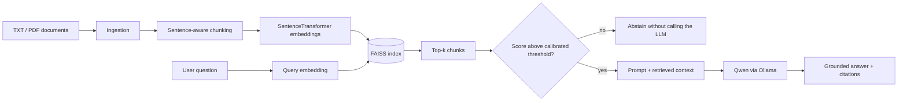

# LLM Knowledge Base Assistant

**A local Retrieval-Augmented Generation service for answering questions from internal TXT/PDF documents.**

The system keeps retrieval and generation local: SentenceTransformers produce embeddings, FAISS performs vector search, and a Qwen model is served through Ollama. The API returns grounded answers with source citations; no paid LLM API is required.

| | |
| --- | --- |
| **Retrieval** | SentenceTransformer embeddings + FAISS |
| **Generation** | Qwen via local Ollama |
| **Serving** | FastAPI |
| **Documents** | TXT / PDF |
| **Evaluation** | retrieval metrics + answer evaluation + citation audit |
| **Packaging** | Docker |
| **Reported retrieval** | Hit@1 **81.82%** · Hit@3 **100%** · MRR@3 **0.9091** |

## Architecture



## Repository structure

| Path | Purpose |
| --- | --- |
| `app/ingestion.py` | TXT/PDF document loading |
| `app/chunking.py` | sentence-aware text chunking |
| `app/embeddings.py` | embedding model integration |
| `app/vector_store.py` | FAISS index persistence/search |
| `app/retrieval.py`, `app/search.py` | retrieval flow |
| `app/rag.py` | retrieval + generation orchestration |
| `app/llm.py` | local Ollama/Qwen generation |
| `app/api.py` | FastAPI service |
| `eval/` | retrieval evaluation, answer evaluation, citation auditing and abstention calibration |
| `eval/results.json` | committed retrieval-metric snapshot regenerated by the evaluator |
| `tests/` | API, ingestion/chunking and vector-store tests |
| `Dockerfile` | containerized service |

## Evaluation

The repository includes a small labeled question set under `eval/questions.json` and separate scripts for retrieval quality, generated-answer evaluation and citation auditing.

Reported retrieval metrics (snapshot: [`eval/results.json`](eval/results.json)):

| Metric | Value |
| --- | ---: |
| Hit@1 | **81.82%** |
| Hit@3 | **100%** |
| MRR@3 | **0.9091** |

These numbers describe the included evaluation set; they are not presented as a general production benchmark.

### Calibrated abstention

The service can reject weak retrieval **before** calling the LLM. No arbitrary default threshold is hard-coded. Instead, the included labeled answerable/unanswerable set can be used to calibrate a cosine-similarity threshold by balanced accuracy:

```bash
python eval/calibrate_abstention.py
export RAG_MIN_RETRIEVAL_SCORE="<printed threshold>"
```

The calibration script writes `eval/threshold.json` with per-question top scores and the selected threshold. The API response exposes `abstained`, `abstention_reason`, and `top_retrieval_score`, so unsupported-query behavior is observable and testable. Because the included evaluation set is small, the threshold should be recalibrated on a larger representative set before production use.

## Run locally

Install Python dependencies:

```bash
python -m venv .venv
source .venv/bin/activate
pip install -r requirements.txt
```

Install and start Ollama separately, then make the configured Qwen model available locally.

Build the document index:

```bash
python -m app.build_index
```

Run the API:

```bash
uvicorn app.api:app --reload
```

Development/test dependencies are listed separately:

```bash
pip install -r requirements-dev.txt
pytest
```

## Design choices

- **Local-first inference** keeps document context off third-party hosted LLM APIs.
- **Retrieval is evaluated independently** from answer generation, so retrieval failures are not hidden behind fluent output.
- **Abstention is calibrated rather than guessed**; a retrieval score gate can stop unsupported questions before generation.
- **Citations are audited separately**, making grounding a measurable concern rather than a prompt-only claim.
- **Chunking, embeddings and vector storage are separate modules**, so retrieval components can be changed without rewriting the API surface.

## Limitations

The included evaluation set is intentionally small, and retrieval quality depends on the source corpus and embedding model. Local generation also depends on the available Ollama model and hardware. This project demonstrates the RAG pipeline and evaluation discipline; it does not claim broad-domain factual reliability.
