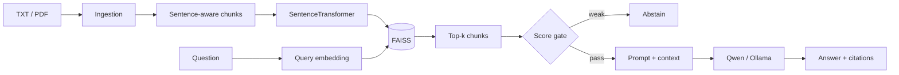

# LLM Knowledge Base Assistant

Local RAG over TXT/PDF documents with evaluated retrieval, source citations and optional confidence-based abstention.

| | |
| --- | --- |
| **Embeddings** | SentenceTransformers |
| **Search** | FAISS |
| **Generation** | Qwen via Ollama |
| **Serving** | FastAPI |
| **Hit@1** | **81.82%** |
| **Hit@3** | **100%** |
| **MRR@3** | **0.9091** |

## Architecture



## Pipeline

Offline indexing:

```text
documents → chunking → embeddings → FAISS index + chunk metadata
```

Online query:

```text
question → query embedding → retrieval → optional score gate
         → grounded prompt → local generation → answer + sources
```

Key modules:

| Path | Responsibility |
| --- | --- |
| `app/ingestion.py` | TXT/PDF loading |
| `app/chunking.py` | sentence-aware chunking |
| `app/embeddings.py` | embedding model |
| `app/vector_store.py` | FAISS persistence/search |
| `app/rag.py` | retrieval + generation orchestration |
| `app/api.py` | FastAPI service |
| `eval/` | retrieval, answer, citation and abstention evaluation |

The embedding revision is pinned so committed retrieval metrics do not silently move with an upstream model update.

## Evaluation

Retrieval is evaluated independently from generation on the included labeled question set.

| Metric | Value |
| --- | ---: |
| Hit@1 | **81.82%** |
| Hit@3 | **100%** |
| MRR@3 | **0.9091** |

Snapshot: `eval/results.json`.

A separate answerable/unanswerable set is used to calibrate an optional retrieval-score threshold:

| Calibration metric | Value |
| --- | ---: |
| Threshold | **0.61346** |
| Balanced accuracy | **90.91%** |
| Answerable recall | **81.82%** |
| Unanswerable recall | **100%** |

The threshold is intentionally **not enabled by default** because the calibration set contains only 14 questions.

Enable it explicitly:

```bash
export RAG_MIN_RETRIEVAL_SCORE="0.61346"
```

The API exposes the abstention decision and top retrieval score so the trade-off remains observable.

## Run

```bash
python -m venv .venv
source .venv/bin/activate
pip install -r requirements.txt

python -m app.build_index
uvicorn app.api:app --reload
```

For local generation, start Ollama separately and make the configured Qwen model available.

Tests:

```bash
pip install -r requirements-dev.txt
pytest
```

Repository-level reproducibility check:

```bash
make install-rag
make rag-verify
```

`make rag-verify` rebuilds retrieval artifacts and compares regenerated metrics with committed snapshots.

## Limitations

The evaluation and calibration sets are small, retrieval quality is corpus-specific, PDF extraction depends on source quality, and local generation depends on the chosen Qwen model and available hardware. The project demonstrates RAG evaluation and serving discipline rather than broad-domain factual reliability.
