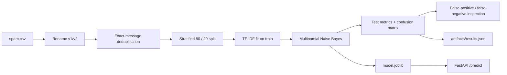

# SMS Spam Detector

A compact text-classification system that takes an SMS message from raw text to a serialized sklearn pipeline and FastAPI inference endpoint.

| | |
| --- | --- |
| **Task** | ham vs spam text classification |
| **Dataset** | SMS Spam Collection |
| **Raw rows** | 5,572 |
| **After exact-message deduplication** | 5,169 |
| **Model** | TF-IDF + Multinomial Naive Bayes |
| **Test precision** | **1.0000** |
| **Test recall** | **0.6183** |
| **Test F1** | **0.7642** |

## 1. Problem

Given one SMS message, predict whether it is:

- `ham` — legitimate message;
- `spam` — unsolicited / spam message.

The project is deliberately simple at the model level and more explicit at the **data-leakage, error-analysis and serving** levels.

---

## 2. Data

Repository file:

```text
data/spam.csv
```

The CSV uses the original `v1` and `v2` fields, which are renamed in code to:

```text
label
message
```

### Class distribution after deduplication

| Class | Messages |
| --- | ---: |
| ham | 4,516 |
| spam | 653 |
| total | 5,169 |

The dataset is imbalanced but not extremely so; precision and recall for the spam class are therefore reported directly.

---

## 3. Leakage control

The raw dataset contains repeated messages. If duplicates are split randomly, an identical SMS can appear in both train and test, which would make the measured result overly optimistic.

The training script therefore performs:

```python
drop_duplicates(subset="message")
```

**before** splitting.

It also asserts that train and test message sets are disjoint.

---

## 4. Workflow



---

## 5. Model pipeline

The complete model is one sklearn Pipeline:

```python
Pipeline([
    ("tfidf", TfidfVectorizer()),
    ("classifier", MultinomialNB()),
])
```

This matters because the serialized `model.joblib` contains both text transformation and classifier state. The API cannot accidentally use preprocessing that differs from training.

### Why this baseline

TF-IDF + Multinomial Naive Bayes is a strong low-complexity reference for sparse bag-of-words text classification:

- low training cost;
- low inference cost;
- deterministic workflow;
- easy serialization;
- a useful benchmark before introducing heavier neural models.

---

## 6. Evaluation design

A stratified split is used:

| Partition | Share |
| --- | ---: |
| Train | 80% |
| Test | 20% |

Configuration:

```text
random_state = 42
stratify = label
```

There is no hyperparameter search in this project, so a separate validation set is not required for model selection.

---

## 7. Results

| Test metric | Value |
| --- | ---: |
| Precision | **1.0000** |
| Recall | **0.6183** |
| F1 | **0.7642** |

### Confusion matrix

Rows are actual classes; columns are predicted classes.

|  | Predicted ham | Predicted spam |
| --- | ---: | ---: |
| Actual ham | 903 | 0 |
| Actual spam | 50 | 81 |

### Error profile

- **False positives:** 0
- **False negatives:** 50

The model is conservative: it avoids flagging legitimate messages in the held-out split, but misses a meaningful fraction of spam.

The training script prints representative false negatives for inspection. Observed misses include adult-service, karaoke, ringtone and premium-rate messages. This is an empirical description of the examples, not a claim that those topics are the cause of every error.

---

## 8. Reproducible artifacts

Training writes two artifacts:

```text
model.joblib
artifacts/results.json
```

`model.joblib` is the full inference pipeline.

`artifacts/results.json` records:

- data path;
- deduplication policy;
- split configuration;
- model type;
- test metrics;
- confusion matrix;
- false-positive / false-negative counts.

---

## 9. Train locally

```bash
cd spam-detector
pip install -r requirements.txt
python train.py
```

The script trains the model, prints metrics and representative errors, saves `model.joblib`, and regenerates the metrics snapshot.

---

## 10. Inference API

Start locally:

```bash
uvicorn app:app --reload
```

### Health

```http
GET /health
```

Response:

```json
{"status": "ok"}
```

### Prediction

```http
POST /predict
Content-Type: application/json
```

Request:

```json
{"text": "Congratulations! You won a free prize"}
```

The endpoint returns the predicted label and spam probability from the serialized pipeline.

---

## 11. Docker

```bash
docker build -t spam-detector .
docker run -p 8000:8000 spam-detector
```

The project is also wired into the repository-level unified FastAPI portfolio.

---

## 12. Limitations and next steps

- The SMS Spam Collection is small and dated compared with current messaging traffic.
- No temporal/domain-shift evaluation is available.
- The baseline does not model word order or contextual semantics beyond TF-IDF features.
- Recall is substantially lower than precision.
- A production system would need threshold/cost analysis, drift monitoring and continuous error review.

A reasonable next experiment would compare the current baseline against character n-grams or a compact transformer while preserving the same deduplication and held-out evaluation protocol.
