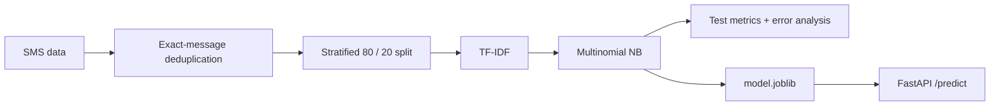

# SMS Spam Detector

A compact text-classification pipeline served through FastAPI.

| | |
| --- | --- |
| **Dataset** | SMS Spam Collection |
| **Rows** | 5,572 raw · 5,169 after deduplication |
| **Model** | TF-IDF + Multinomial Naive Bayes |
| **Test precision** | **1.0000** |
| **Test recall** | **0.6183** |
| **Test F1** | **0.7642** |

## Workflow



## Data and leakage control

Source: `data/spam.csv`.

The original `v1` / `v2` columns are renamed to `label` / `message`. Exact duplicate messages are removed **before** the split so an identical SMS cannot appear in both train and test.

After deduplication:

| Class | Messages |
| --- | ---: |
| ham | 4,516 |
| spam | 653 |

The split is stratified with `random_state=42`.

## Model

The complete training and inference path is serialized as one sklearn Pipeline:

```python
Pipeline([
    ("tfidf", TfidfVectorizer()),
    ("classifier", MultinomialNB()),
])
```

This keeps text preprocessing identical between training and API inference.

## Results

| Metric | Value |
| --- | ---: |
| Precision | **1.0000** |
| Recall | **0.6183** |
| F1 | **0.7642** |

Confusion matrix:

|  | Predicted ham | Predicted spam |
| --- | ---: | ---: |
| Actual ham | 903 | 0 |
| Actual spam | 50 | 81 |

The held-out split contains **0 false positives** and **50 false negatives**. The metric snapshot is committed in `artifacts/results.json`.

## Run and serve

```bash
cd spam-detector
pip install -r requirements.txt
python train.py
uvicorn app:app --reload
```

API:

```text
GET  /health
POST /predict   {"text": "some SMS"}
```

Docker:

```bash
docker build -t spam-detector .
docker run -p 8000:8000 spam-detector
```

## Limitations

The dataset is small and dated, and the baseline does not model contextual semantics. The high precision / lower recall trade-off is specific to this held-out split and should not be treated as current production messaging performance.
